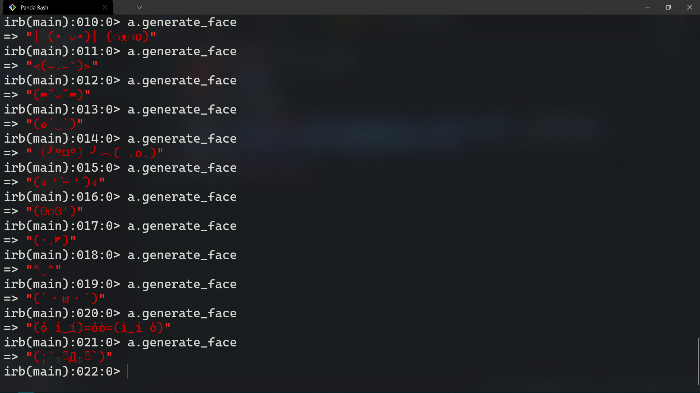

# Textfaces Scraper (づ｡◕‿‿◕｡)づ

> Scraping any text based contet such as text faces to be used anywhere.



Terminal based web scraper to target HTML/XML markup and extract any meaningful content from them.

## Built With

- Ruby
- Nokogiri
- HTTParty

## Getting Started

To get a local copy up and running follow these simple example steps (◕‿◕✿). 

### Prerequisites ༼ʘ̚ل͜ʘ̚༽

- Have Git installed
- Your machine can run Ruby code
- Any bash to excute commands

### Setup

- Clone this repository via Git Clone
- Navigate to the project folder

### Install

- Run bundle install to install project dependencies

### Usage

Run: 
```
$ irb -r ../bin/main.rb
```
Then add the URL to the webpage, the element you target and/or any extra processing needed. 
Like so:
```
$ faces = Scraper.new('https://textfac.es/', 'button.facebtn') do |face_tag|
      face_tag.attributes['data-clipboard-text'].value
  end
```
Finally each time you want a new text face run: 
```
$ faces.generate_face
```    

### Run tests

Run `$ rspec`

## Authors (ღ˘⌣˘ღ)

👤 **Author1**

- GitHub: [@githubhandle](https://github.com/omar-labana)
- Twitter: [@Panda4cs](https://twitter.com/Panda4cs)
- LinkedIn: [LinkedIn](https://www.linkedin.com/in/omarlabana/)

## 🤝 Contributing

Contributions, issues, and feature requests are welcome!

Feel free to check the [issues page](../../issues/).

## Show your support

Give a ⭐️ if you like this project!

## Acknowledgments (✿´‿`)

- [Text Faces](https://textfac.es/)
- [Nokogiri GEM](https://github.com/sparklemotion/nokogiri)

## 📝 License

This project is [MIT](./MIT.md) licensed.
